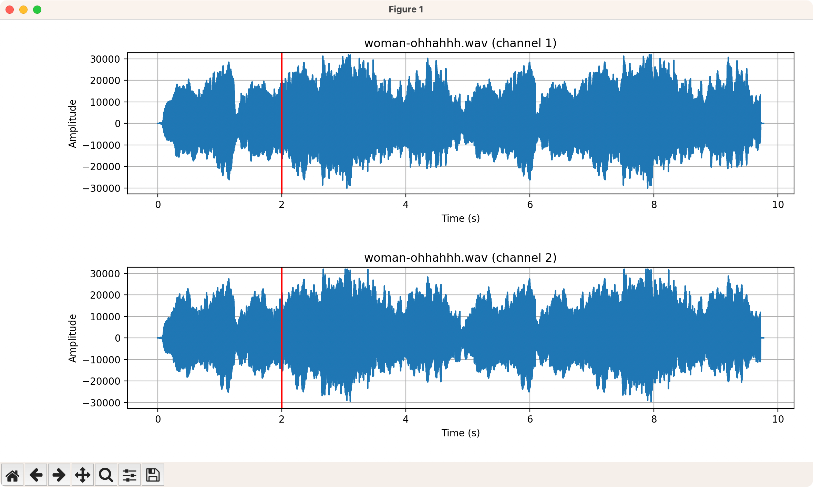

# Lab 1

## Install dependencies

```bash
pip3 install matplotlib
pip3 install numpy
pip3 install tkinter
pip3 install wave
```

## Run the code

```bash
python3 main.py
```

## Result

```bash
bitRate: 1411200 bits per second
bitsPerSample: 16 bits
compressionName: not compressed
compressionType: NONE
duration: 9.76 seconds
filePath: .../lab-1/Sounds/woman-ohhahhh.wav
fileSizeComputed: 1723292.0 bytes
name: woman-ohhahhh.wav
numChannels: 2
numSamples: 430823
sampleRate: 44100 Hz
samples: [0 0 0 ... 5 0 5]
  > Enter CTI position in seconds (max: 9.76): 2
```

