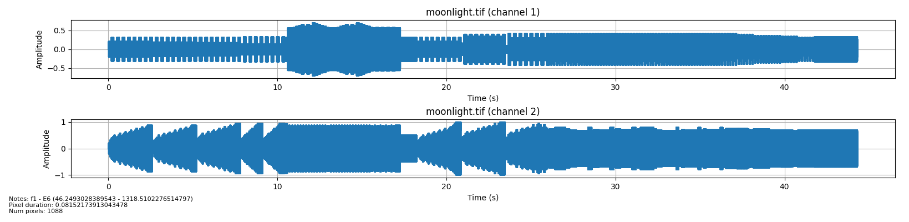

# Praktika

A task for a university class to convert image data into a sound

> Sukurti priemonę, skirtą vaizdams (nuskaitomiems iš grafinių failų) konvertuoti į garsą. Konvertavimo metodas/algoritmas kuriamas/parenkamas autorių sprendimu. Gautasis garso signalas turi atspindėti vaizdo savybes (pasikartojimą, figūras ar pan.). Numatyti galimybę garsą išsaugoti faile.

## Install dependencies

```bash
pip3 install librosa matplotlib numpy sounddevice soundfile
```

## Run example

```bash
python3 main.py
```

### How to

Feed image file you wish to convert into sound


```bash
image_path = "images/moonlight.tif"
image = Bitmap(path=image_path)
```

Optionally, print image data

```bash
print(image.toString())

# Image size: 32x34
# Num pixels: 1088
```

Set-up piano keys by mapping darkest image color to the lowest note, and brightest color to the highest note

```bash
piano = Piano(note_start='f1', note_end='E6')
```

Set-up audio device by providing `sample_rate` in Hz, `pixel_duration` in seconds, `num_channels`:

```bash
audio = Audio(image, piano,
          sample_rate=44100,
          pixel_duration=0.125,
          num_channels=2
        )
```

Start process of converting image data into sound data

```bash
audio.process()
```

Additionally, print audio data

```bash
print(audio.toString())

# Num samples: 2998682
# Sample rate: 44100
# Duration: 67.99732426303855 s
# Notes: ['C♯2', 'G♯2', 'C♯2', 'G♯2', 'C♯2', 'G♯2', 'C♯2', 'G♯2', 'C♯2', 'G♯2'] ...
# Frequencies: [69.29565774421802, 103.82617439498628, 69.29565774421802, 103.82617439498628, 69.29565774421802, 103.82617439498628, 69.29565774421802, 103.82617439498628, 69.29565774421802, 103.82617439498628] ...
```

Save generated audio file

```bash
audio.save()
```

Playback generated file

```bash
audio.play()
```

Plot waveform

```bash
audio.plot()
```



## References

- <https://pages.mtu.edu/~suits/notefreqs.html>
- <https://victormurcia.github.io/Making-Music-From-Images-in-Python/>
